# Kids Book Swap 

The Kids book Swap club in Stockholm is a book club that aims to improve the accessibility of children’s books in different languages by creating a forum for expat parents and kids to swap their books.  We want to make reading more attractive and improve the accesibility. With this website we want to attract more people with clear information and a simple sign up form. In this way we can grow our target audience, provide more books and get more children reading. 

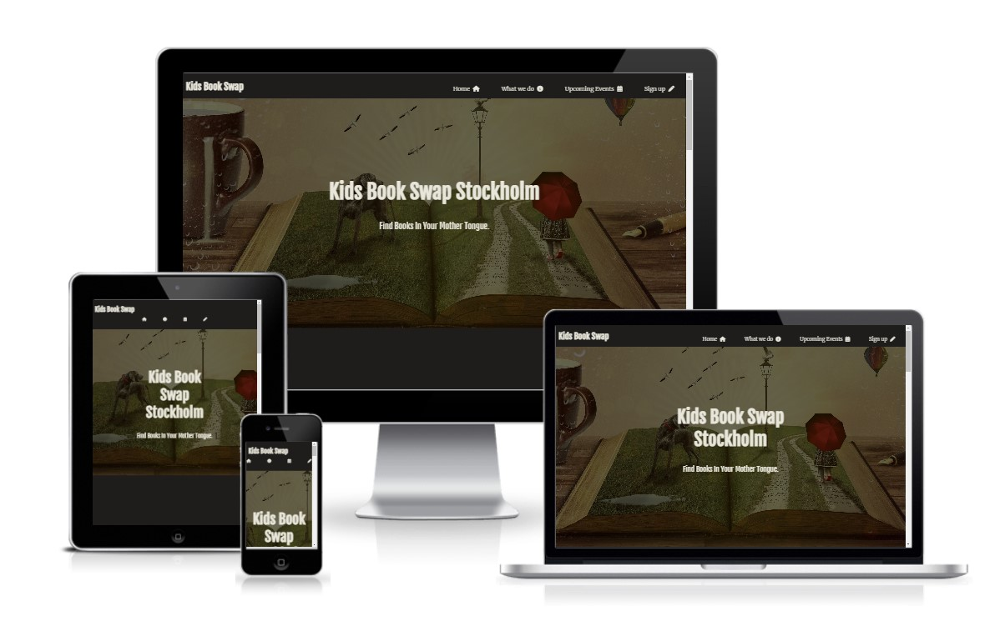

##  Table of content
- [User Experience (UX)](#user-experience--ux-)
- [Technologies used](#technologies-used)
- [Features](#features)
- [Testing](#testing)
- [Deployment](#deployment)
- [Credits](#credits)

## User Experience (UX)
### User stories
#### First Time Visitor Goals
- First time visitors should have a fast understanding what the goal of the organisation is. 
- First time visitors need to get the information about what we do and why we do it 
- First time users should have the ability to find our social media links to get more information 
- First time users should have the ability to ask questions
#### Returning Visitor Goals
- Returning users should be able to go to the event section quickly
- Returning users can easily book an event 
- Returning users should find the links to follow us on social media 
- Returning users should be able to ask questions or give remarks

### Design 

For the design the choice is made for a combination of modern and traditional elements. Books are seen as something old, be we want to reimaging them as something that is also fitting in a modern context, something that is hip, cool and fun while maintaining the more traditional library feel. In this way we hope to not only convince the parents but also the children. 

1. Images

The hero image was selected first. This was chosen because it is a visual representation of what we wanted to achieve as an organisation. 
It supports this idea of reading as supporting creativity, imagination and inspiration. 

The image in the about section was chosen to visually represent our target group and present reading as a fun activity for our kids. 

The background to the event section was chosen to give a more old-school calendar feeling. We try in our website to combine more traditional and modern aspects.  

2. Colour Scheme

The colour scheme was chosen based on the hero picture. 
We choose a darker background and lighter text for creating a cosy, hip and library fitting vibe. 

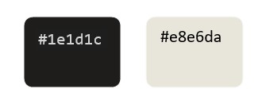

3. Typography

For the logo and the text on the hero picture was the font Fjalla One this font has an elegant design. 
The rest of the text is written in the Merriweather font which was chosen because of its great readability. 
The fonts are both more traditional design with some modern accents which aligns with the feel of the organization and the website. 

## Technologies used 
### languages
- CSS
- HTML

### Frameworks, Libraries & Programs Used
- [google fonts](https://fonts.google.com/): The fonts on this webpage are from the google fonts library 
- [font awesome](https://fontawesome.com/): all the icons on this webpage are from Font awesome
- Git: Git was use commit and push to github 
- [GitPod](https://gitpod.io/): Gitpod was used as development environment 
- [GitHub](https://github.com/): Github was used to deploy the site and store it  

## Features
### Navigation Bar
The website is a single page website. So the navigation bar is an essential part of the website. It allows you to move throughout the different parts of the website without excessive scrolling. The navigation bar is also responsive. When the viewport gets smaller the text converts into symbols that allow for a better layout. 

On the navigation bar is also the logo. When clicked on it go automatically back to the top of the website.

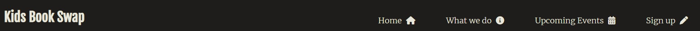

### Hero image and text
The Hero image tries to create a mystical and creative mood. We want to show the image of how books spark our imagination. 

On the hero image you also find "kids book swap club Stockholm" so you know what we do and we are located in Stockholm. 
Under this you also get the text "find books in your mother tongue" so you know it is meant for a expat public. 

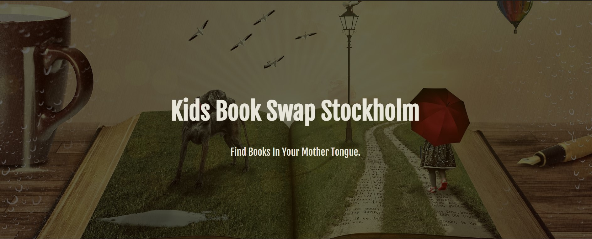

### What we do 
In this section of our webpage we shortly describe why we think reading is important and how we want to support this. We also provide the basic information about our events. 

The text is supported by a picture of a child reading to support the image off reading as a fun and constructive activity.  

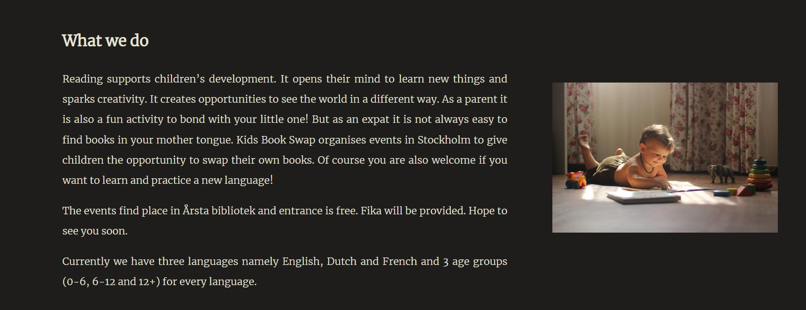

### Events 
In this section we show the upcoming events with the group, place, date and time. 

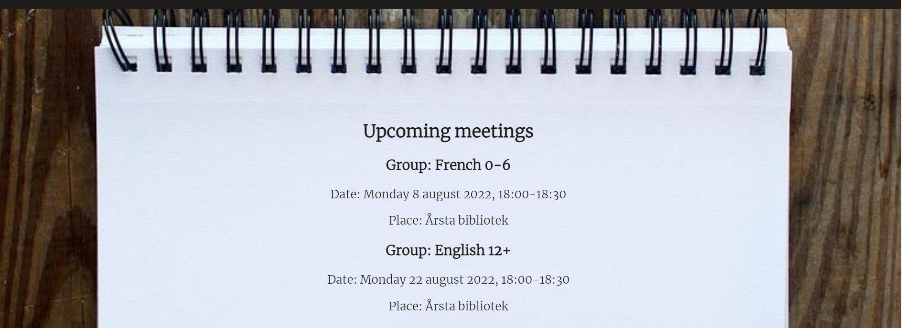
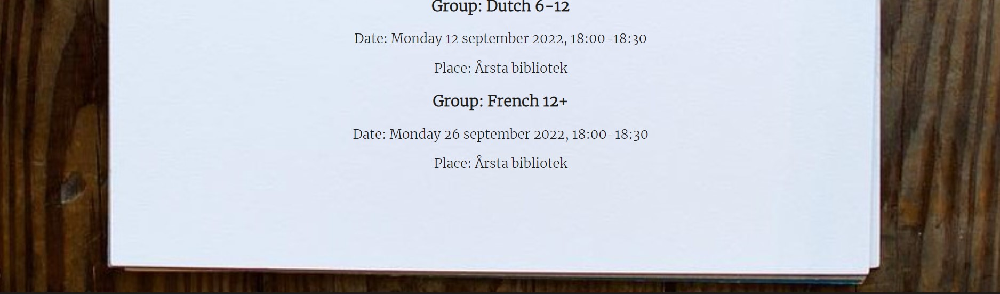

### Registration form
With the registration people can sign up for the events and also ask any additional questions they have. 

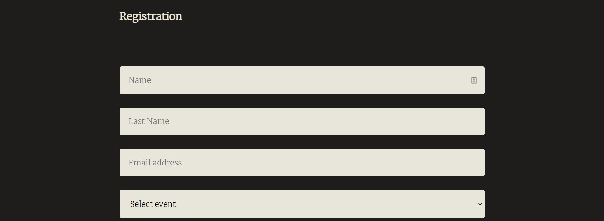
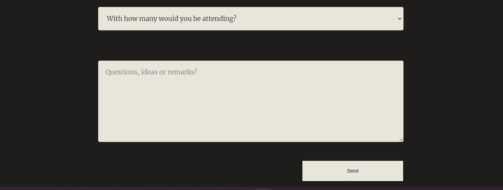

### Footer 
In the footer we provide links to our different social media channels. In this way people can get more information and follow us to be kept up to date with our latest news and upcoming events. 

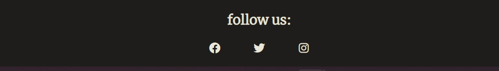

## Testing 
## testing of the user story
### User stories

|Goal| execution|
|--------------------------------------------------------------------------------------|-------------------------------------------------------|
|First time visitors should have an fast understanding of the goal of the organisation| The text on the hero image text shows the main purpose.|
|First time visitors need to get the information about what we do and why we do it.| Information in a what we do section.|
|First time users should have the ability to find our social media links to get more information.| Social media links in the footer.|
|First time users should have the ability to ask questions.| Possibility to ask questions with form|
|Returning users Should be able to go fast to the event section.| Item in navigation bar to scroll down fast|
|Returning users can easily book a event.| Established with the form|
|Returning users should find the links to folow us on social media.| Social media links in the footer.|
|Returning users should be able ta ask questions or give remarks.| Possible in the form.|

## manual code testing
### responsiveness
The website is adapted to be seen on different screen sizes. 
The responsiveness of the website was first tested by chrome developer tools. 
Different breakpoints where used to view the website. 
Next to this the website was viewed on different devices: laptop, tablet and smartphones. 

### Browser compatibility 
The website was tested in different browsers. 

|Browser| compatibility|
|------------------------------------|-------------|
|Mozilla Firefox versie 102.0|no problems|
|Microsoft Edge Versie 103.0.1264.44|no problems|
|Google Chrome Versie 103.0.5060.114 | no problems|

### Validator Testing 
1. HTML

No errors where found by the official W3C validator

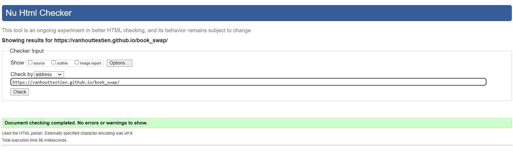

2. CSS
No errors where found by the official Jigsaw validator

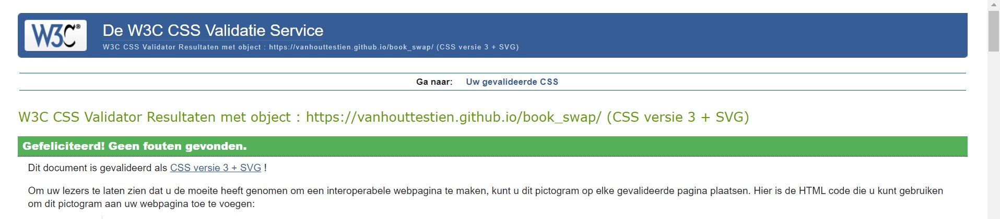

### Fixed bugs 
- Website had a gap on the right which was visible with a smaller screen size. This was fixed by removing padding from a section. 
- Changes in font and font-sizes where fixed by target the text specifically in CSS. 

### Unfixed bugs
The navigation bar seems to be affected by the animation. The cause of this isn't found yet. 

## Deployment 
This site was deployed by GitHub pages. 

To deploy a page you first go to the GitHub repository, then you go to setting. 
Afterwards you go to the subsection pages. 
Next go to the source section and select Branch:main. 
Press save and then you receive a link.  

The link can be found here: https://vanhouttestien.github.io/book_swap/

## Credits

### Images
-  	Image used for heroimage [Image](https://pixabay.com/illustrations/book-dog-fairy-tales-child-kid-794978/) by 0fjd125gk87 from Pixabay 
-	Image used in the 'what we do' section [Image](https://pixabay.com/photos/baby-read-play-reading-playing-5953965/)  by Катерина Кучеренко from Pixabay 
-   Image adapted and used as a background in the 'upcoming events section' [Image](https://pixabay.com/photos/art-watercolors-arts-and-crafts-1851483/by)  Pexels from Pixabay 

### code 
- [This code](https://www.w3schools.com/howto/howto_css_hero_image.asp) was adapted and used for the hero image 
- [This code](https://css-tricks.com/snippets/css/typewriter-effect/) was adapted and used for the typewriter Effect
- On the website of the  [w3schools](https://www.w3schools.com/) I found a lot of information and codes for a variety of problems encountered
- Varies parts of the website were inspired by the love running website from Code institute 
- code for zoom-in effect of hero image adapted from [30secondsofcode](https://www.30secondsofcode.org/css/s/zoomin-zoomout-animation)
